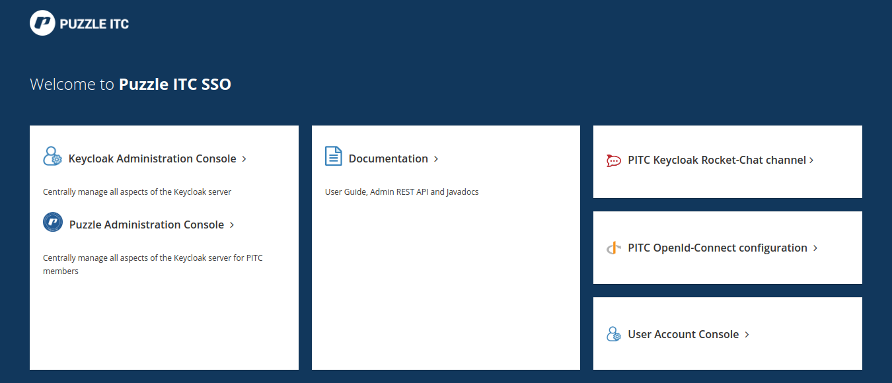

= Puzzle ITC Single Sign-on

////
* Beispiele für Migration eines Projekts aus sso-test.puzzle.ch?
* Problem mit Client Credentials erwähnen (nicht ersichtlich für limitierte Benutzer)
////

[.lead]
Der Puzzle SSO wird laufend erweitert und den aktuellen Gegebenheiten angepasst. Darum kümmert sich primär die _Arbeitsgruppe Keycloak_ aus dem TechConsulting in Abstimmung mit _/sys_, dem _techboard_ sowie dem _branch:security_.

== Kontakt

Der effizienteste Weg um mit der Arbeitsgruppe in Kontakt zu treten ist via RocketChat Channel #keycloak. Alternativ darf nat. auch direkt auf die Member der Arbeitsgruppe zugegangen werden. Die aktuellen Member sind auf der Seite des TechConsulting einsehbar: https://wiki.puzzle.ch/Puzzle/ArbeitsgruppeTechnischesConsulting 

[TIP]
====
Die Einsteigsseite des Puzzle SSO ist so gestaltet, dass diese als Single-Point-of-Entry für alle relevanten Informationen dient.
====

== Setup

Bei Puzzle sind zwei SSO Umgebungen verfügbar:

* `sso.puzzle.ch` -- die Umegbung für ausschliesslich produktive Anwendungen und Benutzer.
* `sso-test.puzzle.ch` -- die Umegbung für alle nicht-produktiven Anwendungen und Benutzer.

Das Setup von des Puzzle SSO ist hochverfügbar auf Openshift aufgebaut. Das produktive Setup verfügt zusätzlich über eine passive Ausfallinstanz ausserhalb OpenShift. Damit wird sichergestellt, dass auch im Falle eines Ausfalls der Openshift-Plattform noch verfügbare Anwendungen weiterfunktionieren.

[TIP]
====
Die Details zum Setup können der Dokumentations des link:https://wiki.puzzle.ch/Puzzle/Keycloak[Dienstes] entnommen werden.
====

Die Ausfallinstanz läuft auf einer dedizierten VM und wird nächtlich aktualisiert. Diese ist im Regelfall unter https://keycloak-fallback.puzzle.ch erreichbar. Im Fall eines Ausfalls der Openshift-Plattform wird der CNAME `sso.puzzle.ch` ebenfalls auf diese Instanz umgestellt, womit alle (zum Zeitpunkt des nächtlichen Imports) verfügbaren Applikationen unterbruchsfrei weiterfunktionieren. Die End-Benutzer müssen sich jedoch neu anmelden.

== Verwalten eigener Artefakte

Die Verwaltung der Puzzle SSO Objekte ist - stand Heute - jedem Member selber überlassen. Er kann sich hierfür mit seinem LDAP Account bei der _Puzzle Administration Console_ anmelden und hat Zugriff auf die Verwaltung von Clients und Users. Zudem kann er die Events einsehen.

[CAUTION]
====
Es gibt Member, welche über das Keycloak Master-Passwort verfügen oder prinzipiell Zugriff darauf haben. Änderungen an der Keycloak-Realm `pitc` über das Master-Passwort sind zu unterlassen, damit eine eindeutige Nachvollziehbarkeit des System gewährleistet bleibt.
====

Es findet kein automatischer Abgleich zwischen den Staging-Umgebungen statt. D.h. die Artefakte müssen von Hand für alle Applikation-Stages erstellt und verwaltet werden.

=== Clients

Clients werden wir im techlab erläutert angelegt. Folgende Tips, Tricks und Vorgaben sollten beachtet werden:

* OpenID Connect ist gegenüber SAML Clients zu bevorzugen.
* Es gilt abstrakt, dass pro Host und/oder Lifecycle in der Regel ein separater Keycloak-Client nötig ist. Bei modernen Architekturen (SPA etc.) sind Frontend und Backend als separate Clients zu erfassen, bei Service-Architekturen die einzelnen Services.
* Client-Type `public/confidential` ist adäquat zu wählen.
* Die Flows sind auf die benötigten einzuschränken: In der Regel werden _Authorization Code_, _Implicit_ oder _Client Credentials_ benötigt. Eine Kombination ist selten nötig. Der _Resource Owner Credentials_ Flows ist bei Puzzle zu vermeiden!
* Die Redirect-URLs sind auf die benötigten zu beschränken, auf Produktion sind globalen Redirects (Wildcards ohne Einschränkung auf einen Host) oder solche auf lokale URLs zu unterlassen.
* Wenn die Javascript Keycloak-Bibliothek über den SSO (z.B. https://sso.puzzle.ch/auth/js/keycloak.js für Produktion) bezogen wird, wird automatisch die korrekte kompatible Version zum SSO verwendet.

[TIP]
====
Mit der aktuellen Keycloak-Version und dem Preview-Feature das wir für die Feingranulare Zugriffskontrolle auf die Administration Console von Keycloak nutzen, gibt es einen Bug beim Darstellen der Client-Secrets (_Persmission denied_). Das Client-Secret kann aber unter dem Tab _Installation_ dennoch angezeigt werden.
====

=== Users

User müssen auf dem Puzzle SSO nicht manuell angelegt werden. Sowohl auf sso-test.puzzle.ch wie auch auf sso.puzzle.ch werden die User aus dem LDAP synchronisiert. Folgende Tips, Tricks und Vorgaben sollten beachtet werden:

* Auf dem produktiven System dürfen keine lokalen User angelegt werden! Auf dem Integrationsystem sind  auch für lokale User prinzipiell sichere Passwörter zu verwenden! Jeder lokale User muss direkt oder indirekt einem zuständigen Member zugeordnet werden (eMail, Name/Vorname oder Attribut).
* Es dürfen bei Bedarf beliebig Gruppen angelegt werden.
* Realm Roles sind soweit möglich zu unterlassen und stattdessen Client Roles zu verwenden (das Flag `use-resource-role-mappings=true` sollte für die Keycloak Adapter verwendet werden).

== Weiterentwicklung

=== Stand heute

Heute besitzt jeder Puzzle Member die Möglichkeit alle auf dem Puzzle SSO vorhandenen Clients und User einzusehen und zu verwalten. Dies hat den wesentlichen Vorteil, dass sich alle Member im self-service Modus helfen können und nicht auf eine zentrale Verwaltung angewiesen sind. Dieser Vorteil ist zugleich aber auch unser grösster Nachteil:  So fehlt uns aktuell die  Kontrolle über neue Objekte und ein gewisses Chaos macht sicht breit. Zudem ist es aktuell nur manuell möglich Misskonfigurationen oder Missbräuche zu erkennen.

=== Stand 2020

Mit dem stetigen Wachstum von Members und Keycloak-Objekte wird mit der aktuellen Konfiguration die Kontrolle zunehmend unhaltbar. Zudem wird zusätzliche Funktionalität gewünscht. Der Puzzle SSO wird deshalb bis Ende 2019 wie folgt angepasst:

. Alle nicht-produktiven Objekte müssen von sso.puzzle.ch auf die nicht-produktive Umgebung sso-test.puzzle.ch migriert werden. Auffallende Objekte werden zuerst deaktiviert und ohne aktive Rückmeldung ohne Rückfrage 5 Tage später gelöscht. 
. Im produktiven SSO wird 2FA erzwungen. Es kann zwischen OTP und U2F (yubikey) gewählt werden. Die Lebensdauer der Login-Sessions wird auf einen Arbeitstag erhöht.
. Keycloak wird schreibend an das LDAP angebunden. Das hat zur Folge, dass das (LDAP-)Passwort, die SSH-Keys und weitere Attribute von den Member in Zukunft selbst über den Keycloak gepflegt werden können.
. Die Möglichkeit der Member, alle User zu verwalten wird entfernt. Im Gegenzug wird eine Pipeline aufgebaut, welche das einhalten des Stagings und auf Produktion zusätzlich das Vier-Augenprinzip erzwingt.

=== Stand Zukunft

Weitere Anwendungen werden in den SSO integriert. Der PoC für Ruby-Anwendungen hat mit Puzzle-Skills erfolgreich stattgefunden. 