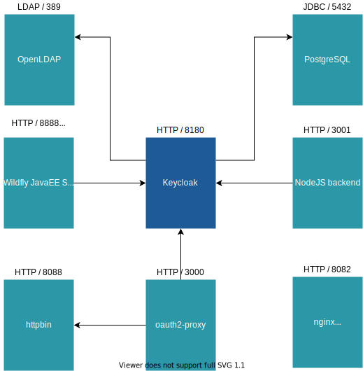

= Lab Setup

This chapter describes how to setup a local Keycloak environment based on the prebuilt Docker Images. All Labs of this Techlab are based on this environment, the Realms, Users and Clients created in the following chapters.

=== Prerequisites

The following tools need to be installed on the machine used for this Techlab:

- link:https://docs.docker.com/install/[Docker]
- link:https://docs.docker.com/compose/install/[Docker Compose]
- link:https://curl.haxx.se/[cURL]
- link:https://stedolan.github.io/jq/[jq - commandline JSON processor]
- link:https://openjdk.java.net[Java 1.8+]
- link:https://maven.apache.org/install.html[Apache Maven 3.5+]

=== Clone and start Keycloak environment

Clone Repository and start with docker-compose

[source,sh]
----
git clone https://github.com/puzzle/keycloak-techlab-setup.git && cd keycloak-techlab-setup
docker-compose up
----

This will start a Keycloak instance using a PostgreSQL database as persistence and some additional services that we will use during this Techlab.

[NOTE]
====
Since we are using Docker-Compose and Volumes all data will remain persisted even after stopping and recreating the containers.
====

In the following Labs we will communicate with Keycloak both from our local browser installed in the host OS and as well from deployed applications sitting in other containers. In order to always work with the same hostname and port (`keycloak:8180`) from the host OS as also from within inside a container, it is mandatory to create a entry in your local `/etc/hosts` file:

[source,sh]
----
127.0.0.1    keycloak
----

After starting, your local Keycloak _Administration Console_ should be exposed at http://keycloak:8180. Please check that the Administration Console is displayed correctly. You should see the same as by opening http://localhost:8180.

[NOTE]
====
The Container `gatekeeper_1` will not start successfully during the initial startup and stops with the Error message `[error] failed to retrieve the provider configuration from discovery url - techlab-setup_gatekeeper_1 exited with code 1`. This is because it tries to access the Realm `techlab` which we will create later on in this Lab. You can ignore this error until we created the missing Realm.
====

== Overview of the Dockerized Lab Setup

== Create a new Realm

First login to your _Administration Console_ at http://keycloak:8180 and login with the Master-Credentials:

* username: `admin`
* password: `password`

Now create a new _Realm_ with name `techlab`.

You will find the button `Add realm` on the top left by moving the mouse over Master.

[CAUTION]
====
The default Realm is `master`. Keycloak uses this for basic functionality, so you should have good reasons to *not* edit or even delete this realm. It's always a good idea to create a new realm even for testing purposes.
====

Additionally, we want to enable traceability and auditing in our freshly created realm. In Keycloak thats simply called `Events`. 

    Events -> Config -> Enable Save Events for Login Events and Admin Events -> Save

Additionally add the types `INTROSPECT_TOKEN` and `INTROSPECT_TOKEN_ERROR` to the _Saved Types_ of _Login Events_.

== Create a User (an Identity)

Next, we create the required users.

Create a new _User_ with name `nerd`

    Users -> Add User -> Username: nerd -> Save

Set the initial Password of the User `nerd` to `quirky`

    Users -> select User nerd -> Credentials -> set new Password -> Set "Temporary" to off -> Reset Password

Go to http://keycloak:8180/auth/realms/techlab/account and login with the newly created user to verify everthing went well so far.

== Create a Realm Role (a global Access Right at Realm level)

Next create a new _Role_ with name `techlab-user` in this Realm:

    Roles -> Add Role -> Role Name: techlab-user -> Save

[TIP]
====
It's always a good idea to describe roles using the `Description` field for the unambiguous interpretation at a later date.
====

Assign the role `techlab-user` to the user `nerd`

    Users -> select User nerd -> Role Mappings -> select Role techlab-user from Available Roles -> Add selected

[TIP]
====
In an environment with a large number of users, it is advisable to use groups and not to map users directly to roles.
====

== View changes in Audit Log

Go to `Events -> Admin Events` to see all changes you made so far.

== Read Metadata of the Keycloak Server

Reads the metadata of the Keycloak Server for the Realm `techlab`

[source,sh]
----
curl -s http://keycloak:8180/auth/realms/techlab/.well-known/openid-configuration | jq
----

You will see which Features are enabled, the available Endpoints of the Keycloak instance, Supported Scoped, Algorithms etc.

'''
[.text-right]
link:../README.adoc[<- Techlab overview] | 
link:./02_oauth2.adoc[OAuth 2.0 ->]
