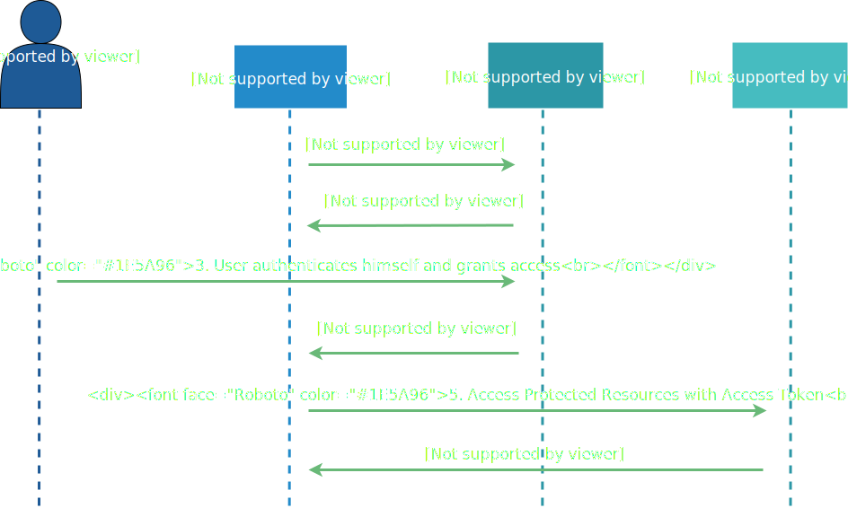

:experimental:

= OAuth 2.0 - Implicit Flow

The _Implicit Flow_ is defined in the link:https://tools.ietf.org/html/rfc6749#section-4.2[rfc6749] as follows:

[quote, rfc6749]
____
The implicit grant type is used to obtain access tokens (it does not support the issuance of refresh tokens) and is optimized for public clients known to operate a particular redirection URI.  These clients are typically implemented in a browser using a scripting language such as JavaScript.

Since this is a redirection-based flow, the client must be capable of interacting with the resource owner's user-agent  typically a web browser) and capable of receiving incoming requests (via redirection) from the authorization server.

Unlike the authorization code grant type, in which the client makes  separate requests for authorization and for an access token, the client receives the access token as the result of the authorization request.

The implicit grant type does not include client authentication, and relies on the presence of the resource owner and the registration of the redirection URI. Because the access token is encoded into the redirection URI, it may be exposed to the resource owner and other applications residing on the same device.
____

So, the Implicit Flow is a simplification of the authorization code flow and is mainly used in JavaScript-based clients running in the insecure context of a browser. That's why there is no authentication of the client (e.g. the javascript application) from the authorization server.

// TODO: Show what happens when token lifetime is over. Best with an example and lab. Show the difference for all flows.

[TIP]
====
There is a more abstract and theoretical flow explanation in the link:https://tools.ietf.org/html/rfc6749#section-4.2[rfc6749]
====

== Lab

The JavaScript application used by this lab is already provided by the Docker Compose of the techlab-setup. Go to your local Keycloak Administration Console at http://keycloak:8180/auth/ and login with User `admin` and Password `password`

== Create a new Client

Create a new public Client `js-console`.

Enable `Implicit Flow` for Client `js-console`

Configuring `Valid Redirect URI` for this Client to `http://localhost:8082/*`.

Configuring `Web Origins` for this Client to `*`.

And open the js-console at http://localhost:8082/js-console/.

Open Developer Tools of browser kbd:[*F12*] and make sure to log all requests.

In the app click "Login" and enter credentials: User `nerd` and password `quirky`.

Inspect the developer console and find the relevant http requests and responses which are used for the Implicit Flow.

Try to match the captured requests and responses to the Implicit Grant Flow figure you find above.

[QUESTION]
====
How is the Access Token transferred to the client?
====

== Lab Solutions
Solutions of this Lab can be found link:../solutions/02b_oauth2-implicit-flow-solutions.adoc[here].

== Sources

* https://tools.ietf.org/html/rfc6749#section-4.2

'''
[.text-right]
link:../README.adoc[<- Techlab overview] | 
link:./02c_oauth2-client-credentials-flow.adoc[OAuth 2.0 Client Credentials Flow ->]
