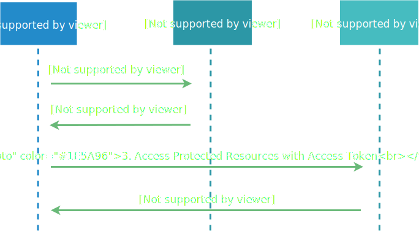

= OAuth 2.0 - Client Credentials Flow

The _Client Credentials Flow_ is defined in the link:https://tools.ietf.org/html/rfc6749#section-4.4[rfc6749] as follows:

[quote, rfc6749]
____
The client can request an access token using only its client credentials (or other supported means of authentication) when the client is requesting access to the protected resources under its control, or those of another resource owner that have been previously arranged with the authorization server (the method of which is beyond the scope of this specification).
____

So, the Client authenticates itself only (without a User involved). This flow must only be used with confidential Clients and not with public Clients. A Confidential Client can store the credentials securely and prevent access from any third parties. 

Possible use-cases for this flow:

* No End-User is involved
* Machine-to-machine communication
* CLI Clients, Daemons

[TIP]
====
There is a more abstract and theoretical flow explanation in the link:https://tools.ietf.org/html/rfc6749#section-4.4[rfc6749]
====

== Lab

Create a new confidential Client `techlab-cli-confidential` in Keycloak.
Go to http://keycloak:8180/auth/admin/ and Login with user `admin` and password `password`.

    Clients -> Add Client -> Client ID `techlab-cli-confidential` -> Save

Use the following configuration for the Client:

* Valid Redirect URIs: http://localhost:3001/*
* Access Type: `confidential`
* Service Accounts Enabled: True. (See tooltip: _In terms of OAuth2 specifications, this enables "Client Credentials Grant" support for this client_)

[TIP]
====
The Administration Console of Keycloak does often not use the OAuth 2.0 terminology. But fortunately, Keycloak provides tooltips that contain the reference to the official OAuth 2.0 terminology.
====

Go to tab `Credentials` and copy the Client Secret to clipboard (Secret looks similar to `7697c98b-5f8a-4638-987f-ce82747853a3`).

Next, set the secret as environment variable:

[source,bash]
----
export CLIENT_SECRET=<<<MY_COPIED_SECRET>>>
----

Now generate an access token with `grant_type=client_credentials` for confidential client `techlab-cli-confidential`:

[source,bash]
----
curl -s -X POST http://keycloak:8180/auth/realms/techlab/protocol/openid-connect/token \
  -H "content-type: application/x-www-form-urlencoded" \
  -d "client_id=techlab-cli-confidential&grant_type=client_credentials&client_secret=${CLIENT_SECRET}" | jq
----

[NOTE]
====
* Using the Client Credentials Flow by defining `grant_type=client_credentials`
* Providing the Clients Secret with attribute `client_secret`
====

What happens when you execute the request again but with the `client_id` from the previous Lab? Can you explain why this happens?

[TIP]
====
You will find the answer in the https://tools.ietf.org/html/rfc6749#section-4.4[RFC]
====

Check again the link:http://keycloak:8180/auth/admin/master/console/\#/realms/techlab/events[Keycloak Event Console] and link:http://keycloak:8180/auth/admin/master/console/\#/realms/techlab/sessions/realm[Sessions View] the active Sessions.

== Lab Solutions
Solutions of this Lab can be found link:../solutions/02c_oauth2-client-credentials-flow-solutions.adoc[here].

== Sources

* https://tools.ietf.org/html/rfc6749#section-4.4

'''
[.text-right]
link:../README.adoc[<- Techlab overview] | 
link:./02d_oauth2-resource-owner-credentials-flow.adoc[OAuth 2.0 Resource Owner Password Credential Flow ->]
