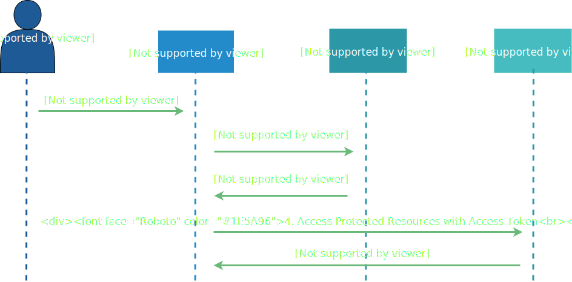

= OAuth 2.0 - Resource Owner Password Credentials Flow

The _Resource Owner Password Credentials Flow_ is defined in the link:https://tools.ietf.org/html/rfc6749#section-4.3[rfc6749] as follows:

[quote, rfc6749]
____
The resource owner password credentials grant type is suitable in cases where the resource owner has a trust relationship with the client, such as the device operating system or a highly privileged application.  The authorization server should take special care when enabling this grant type and only allow it when other flows are not viable.

This grant type is suitable for clients capable of obtaining the resource owner's credentials (username and password, typically using an interactive form). It is also used to migrate existing clients using direct authentication schemes such as HTTP Basic or Digest authentication to OAuth by converting the stored credentials to an access token.
____

So, the credentials of the _Resource Owner_ will be shared with the client. 

Possible use-cases for this flow:

* When no other flows are available/possible
* Integration of legacy systems with technical users
* Batch processing when _Resource Owner_ provides credentials is delayed from authentication request

[CAUTION]
====
Use this flow wisely and only with trusted and confidential clients.
====

[TIP]
====
There is a more abstract and theoretical flow explanation in the link:https://tools.ietf.org/html/rfc6749#section-4.3[rfc6749]
====

== Lab

Make sure that the environment variable `CLIENT_SECRET` is still set with the Credential of `techlab-cli-confidential` Client from previous lab:

[source,bash]
----
echo $CLIENT_SECRET
----

Generate an Access Token for User `nerd` with `grant_type=password` by executing the following HTTP POST Request:

[source,bash]
----
curl -s -X POST http://keycloak:8180/auth/realms/techlab/protocol/openid-connect/token \
    -H "content-type: application/x-www-form-urlencoded" \
    -d "client_id=techlab-cli-confidential&client_secret=${CLIENT_SECRET}&username=nerd&password=quirky&grant_type=password" | jq
----

[NOTE]
====
* Using the Resource Owner Credentials Flow by defining `grant_type=password`
* Resource Owner credentials are provided as parameters `username` and `password`
* Use this Flow only with confidential Clients as the Resource Owner provides its password to the client.
====

Goto http://keycloak:8180/auth/admin/master/console/#/realms/techlab/events[Keycloak Event Console] and see the details to the login request.

On the http://keycloak:8180/auth/admin/master/console/#/realms/techlab/sessions/realm[Sessions View] all currently active Sessions are listed.

== Sources

* https://tools.ietf.org/html/rfc6749#section-4.3

'''
[.text-right]
link:../README.adoc[<- Techlab overview] | 
link:./03_openidconnect.adoc[OpenID connect ->]