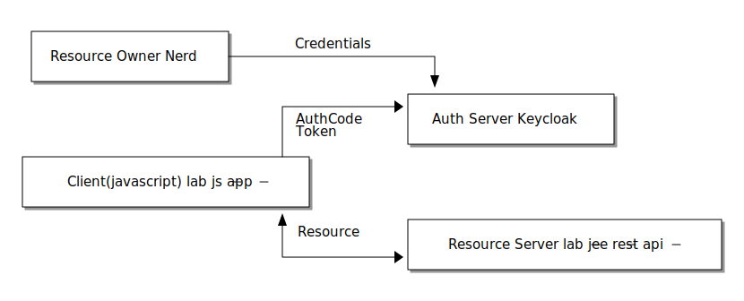

= Secure a JEE (Wildfly) based restful API

This Lab is based on `service-jee-jaxrs` of the link:https://github.com/keycloak/keycloak-quickstarts.git[Keycloak quickstarts]. It uses the Keycloak Wildfly Adapter to enforce the policies. 

In this lab we are going to create a restful _Resource Server_ and requesting it's resources using a javascript application as _Client_ (we will create this client with the next lab). The credentials of _Resource Owner_ `Nerd` will be used in combination with the _Authorization Code_ or _Implicit_ Flow to obtain a valid token.

ifndef::env-github[]
[ditaa, "../images/jee-jaxrs-flow", svg]
----
 +---------------------+ 
 |                     |      Credentials
 | Resource Owner:Nerd +----------------------+
 |                     |                      |
 +---------------------+                      v
                                           +--+-------------------+
                             +------------>+                      |
                             | AuthCode    | Auth Server:Keycloak |
                             | Token       |                      |
                             |             +----------------------+
+----------------------------+--+
|                               |
| Client(javascript):lab-js-app |
|                               |
+----------------------------+--+
                             ^             +----------------------------------+
                             | Resource    |                                  |
                             |             | Resource Server:lab-jee-rest-api |
                             +------------>+                                  |
                                           +----------------------------------+
----
endif::env-github[]
ifdef::env-github[]

endif::env-github[]

We start by creating the client definitions. Create a new client named `lab-jee-rest-api`. You have learned the basics of what important settings an *API client* needs in the previous theoretical labs and we have already seen the special `bearer_only` type -- so try to reflect the learned and create the client without guidance.

////
Create a new client `lab-jee-rest-api` with _Access Type_ `bearer-only`.
////

In your Keycloak client definition go to the _Installation_ tab, select `Keycloak OIDC JSON` as format and download your client configuration.

Move this to your project:

[source,sh]
----
mv ~/downloads/keycloak.json ../keycloak-quickstarts/service-jee-jaxrs/config
----

We want to move forward quickly and deploy the application right away:

[source,sh]
----
mvn install wildfly:deploy -Dwildfly.username=admin -Dwildfly.password=secret
----

[TIP]
====
Failed? If you got an error like `_Source/Target option 5 is no longer supported. Use 7 or later._`. Add the following into your `<properties>` section within `pom.xml` (adjust the Java version to your local JDK version):

[source,xml]
----
<java.version>1.11</java.version>
<maven.compiler.source>1.11</maven.compiler.source>
<maven.compiler.target>1.11</maven.compiler.target>
----
====

After successful deployment, check that the service can be reached at http://localhost:8888/service/public.

As you can see, we did not have to adapt much. The advantage of JEE are the many standards. But an appropriate implementation are necessary. In this case the Wildfly Keycloak Adapter. We have already integrated this adapter into the lab setup. If you are interested take a look into the docker-compose file of the techlab setup repository.

Next, take a look into the deployment descriptor file `src/main/webapp/WEB-INF/web.xml` and try to understand the constraints.

The service has more resources under `/secured` and `/admin`. If you have not done so yet, you should now create the roles for them. Since `admin` is not typically a realm role, we recommend using client roles. Choose what you better like, but don't forget to adapt the client accordingly.

////
Pitfall: The secured resource uses a role named `user` not `secured`.
if needed: add `"use-resource-role-mappings": true` to keycloak.json or download a fresh one from Keycloak.
////

[TIP]
====
With the provided Docker-based setup you should configure your Applications to Access Keycloak by hostname `keycloak` instead of `localhost`. Wildfly can't reach Keycloak through localhost (they are running in different containers). `keycloak` is the name of the Docker Compose service and accessible by other containers in the same compose definition.
====

If you like, you can also test this restful API using cURL or postman. In the next lab, we deploy a user interface that is going to use this service.

'''
[.text-right]
link:../README.adoc[<- Techlab overview] | 
link:./05c_javascript-app.adoc[Secure Javascript Application ->]
