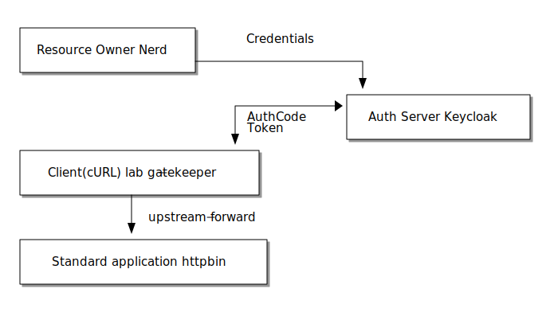

= Secure a "legacy" or "standard" applications using oauth2proxy

[NOTE]
====
The Gatekeeper / Louketo Proxy previously used in this lab has been end of live since November 2020 and is no longer maintained. The open source link:https://github.com/oauth2-proxy/oauth2-proxy[oauth2-proxy] project is now used as an alternative.
====

In this lab we leave the world where we can change software arbitrarily. Sometimes you want to protect standard software with Keycloak that does not support OpenID connect or SAML. For this use case we use a link:https://github.com/oauth2-proxy/oauth2-proxy[oauth2-proxy] which mediates OAuth 2.0 / OIDC with Keycloak for the standard software.

For this lab we use link:https://hub.docker.com/r/kennethreitz/httpbin/[httpbin] by Kenneth Reitz as standard application that we want to protect. httpbin is already integrated in the docker-compose setup of this techlab and available at http://localhost:8088/.

ifndef::env-github[]
[ditaa, "../images/proxy-flow", svg]
----
+---------------------+
|                     |     Credentials
| Resource Owner:Nerd |
|                     +--------------------+
+---------------------+                    |
                                           v
                                         +-+--------------------+
                           +------------>+                      |
                           | AuthCode    | Auth Server:Keycloak |
                           | Token       |                      |
                           v             +----------------------+
+--------------------------+--+
|                             |
| Client(cURL):lab-proxy |
|                             |
+-------------+---------------+
              |
              | upstream-forward
              v
+-------------+----------------+
|                              |
| Standard application:httpbin |
|                              |
+------------------------------+
----
endif::env-github[]
ifdef::env-github[]

endif::env-github[]

Create a confidential client definition for gatekeeper in Keycloak with the name `lab-proxy`.

[TIP]
====
The proxy acts as kind of a backend-application, you may choose the default flow type.
====

////
Standard Flow: Enable
Access Type: Confidential
////

Go to the docker-compose setup and adjust the client-secret to the newly generated one.

[TIP]
====
You might want to restart the proxy independently with:
[source,sh]
----
docker-compose up --build --detach oauth2proxy
----
====

The proxy service is available at http://localhost:3000. It is already preconfigured for you.

Try to open http://localhost:3000/ip, which should return your current ip. 

Does the request work? 

Currently you just have to be authenticated to access the httpbin resources via the gatekeeper proxy. As a next step we would like to additionally authorize the call to `/ip` and `/anything` using separate client roles in Keycloak. Try to implement that.

////
* Create two new Client Roles gatekeeper-ip and gatekeeper-anything and map them to user
* Extend the startup command in docker-compose.yaml of Gatekeeper:
    command:
      - --verbose=true
      - --redirection-url=http://localhost:3000
      - --secure-cookie=false
      - --encryption-key=AgXa7xRcoClDEU0ZDSH4X0XhL5Qy2Z2j
      - --enable-refresh-tokens=true
      - --enable-session-cookies=true
      - --enable-default-deny=true
      - --enable-logging=true
      - --resources=uri=/*
      - --resources=uri=/ip|roles=lab-gatekeeper:gatekeeper-ip
      - --resources=uri=/anything|roles=lab-gatekeeper:gatekeeper-anything
      - --upstream-url=http://httpbin:80
////

[TIP]
====
Do rebuild the Docker-Image if you change the command (e.g. adding  `--resources=...` arguments). Check your gatekeeper log for records of the kind "Protecting resource ..." to make sure your changes got properly applied.
====

Test your implementation and take a look into the response of a request to `http://localhost:3000/anything`. Are there any upstream headers present that give us user details?

////
The following X-Auth-* Request-Headers about the user will be added by Gatekeeper and provided to the requested upstream endpoint:
Email, Groups, Roles, Token, Userid, Username
////

How will the Access Token be transferred to the client?

////
Access Token will be set as Browser Cookie with default name `kc-access`.
////

'''
[.text-right]
link:../README.adoc[<- Techlab overview] |
link:./06_additional-labs.adoc[Additional Labs ->]
