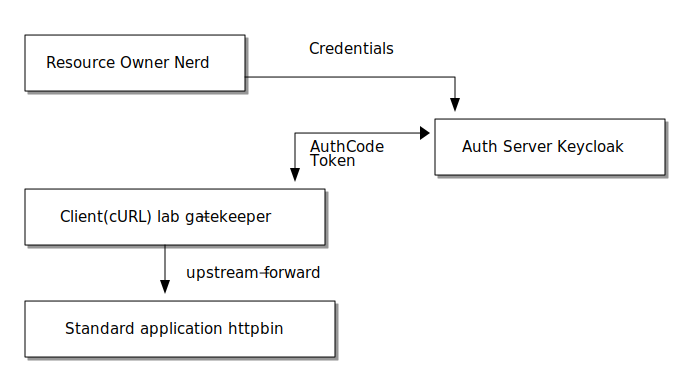

= Secure a "legacy" or "standard" applications using oauth2proxy

[NOTE]
====
The Gatekeeper / Louketo Proxy previously used in this lab has been end of live since November 2020 and is no longer maintained. The open source link:https://github.com/oauth2-proxy/oauth2-proxy[oauth2-proxy] project is now used as an alternative.
====

In this lab we leave the world where we can change software arbitrarily. Sometimes you want to protect standard software with Keycloak that does not support OpenID connect or SAML. For this use case we use a link:https://github.com/oauth2-proxy/oauth2-proxy[oauth2-proxy] which mediates OAuth 2.0 / OIDC with Keycloak for the standard software.

For this lab we use link:https://hub.docker.com/r/kennethreitz/httpbin/[httpbin] by Kenneth Reitz as standard application that we want to protect. httpbin is already integrated in the docker-compose setup of this techlab and available at http://localhost:8088/.

ifndef::env-github[]
[ditaa, "../images/proxy-flow", svg]
----
+---------------------+
|                     |     Credentials
| Resource Owner:Nerd |
|                     +--------------------+
+---------------------+                    |
                                           v
                                         +-+--------------------+
                           +------------>+                      |
                           | AuthCode    | Auth Server:Keycloak |
                           | Token       |                      |
                           v             +----------------------+
+--------------------------+--+
|                             |
| Client(cURL):lab-proxy      |
|                             |
+-------------+---------------+
              |
              | upstream-forward
              v
+-------------+----------------+
|                              |
| Standard application:httpbin |
|                              |
+------------------------------+
----
endif::env-github[]
ifdef::env-github[]

endif::env-github[]

Create a confidential client definition for the proxy in Keycloak with the name `lab-proxy`.

[TIP]
====
The proxy acts as kind of a backend-application, you should choose the default flow type.
====

////
Standard Flow: Enable
Access Type: Confidential
////

Go to the docker-compose setup and adjust the client-secret to the newly generated one.

[TIP]
====
You might want to restart the proxy independently with:
[source,sh]
----
docker-compose up --force-recreate --detach oauth2proxy
----
====

The proxy service is available at http://localhost:3000. It is already preconfigured for you.

Try to open http://localhost:3000/ip, which should return your current ip. 

Does the request work? 

Currently, it is sufficient only to be authenticated to access the httpbin resources through proxy. As a next step we would like to additionally authorize the calls `/headers` using a client role in Keycloak.

For this add a new mapper to the `lab-proxy` client: 

[subs="+replacements,quotes"]
    create -> Mapper Type: User Client Role -> Client ID: lab-proxy -> Add to ID token: true (disable access token and userinfo).

[TIP]
====
The oauth2proxy uses the OIDC provider to integrate with Keycloak. This provider completely ignores the Access Token and this is why we have to map the roles to the ID Token.

There is also a Keycloak provider. But actually it does not provide more / better features. Instead of using the ID Token it fetches the roles of the UserInfo endpoint.
====

Create a new client role called `proxy-headers` to the `lab-proxy` client and assign the user `Nerd` to it.

Try to open http://localhost:3000/headers. You should see an element `X-Forwarded-Groups` with the newly generated role in it. 

Ok? Now we can adjust the proxy settings to check for this role: `OAUTH2_PROXY_ALLOWED_GROUPS: "proxy-headers"`.

////
* Create a new Client Role proxy-headers and map them to user
* Adjust proxy service and extend command in docker-compose.yaml of oauth2proxy:
  oauth2proxy:
    image: quay.io/oauth2-proxy/oauth2-proxy:v7.0.0
    ports:
      - 3000:3000
    environment:
      OAUTH2_PROXY_HTTP_ADDRESS: 0.0.0.0:3000
      # proxy only these endpoints - otherwise 404
      OAUTH2_PROXY_UPSTREAMS: http://httpbin:80/ip,http://httpbin:80/headers
      OAUTH2_PROXY_REDIRECT_URL: http://localhost:3000
      OAUTH2_PROXY_PROVIDER: oidc
      OAUTH2_PROXY_CLIENT_ID: lab-proxy
      OAUTH2_PROXY_CLIENT_SECRET: 86bc47ba-9ecb-41b0-9947-8ba4291fab83
      OAUTH2_PROXY_OIDC_ISSUER_URL: http://keycloak:8180/auth/realms/techlab
      OAUTH2_PROXY_COOKIE_SECURE: "false"
      OAUTH2_PROXY_COOKIE_SECRET: somerandomstring12341234567890AB
      OAUTH2_PROXY_EMAIL_DOMAINS: "*"
      OAUTH2_PROXY_SKIP_PROVIDER_BUTTON: "true"
      OAUTH2_PROXY_SCOPE: "openid profile email"
      OAUTH2_PROXY_COOKIE_REFRESH: "5m"
      OAUTH2_PROXY_OIDC_EMAIL_CLAIM: "email"
      OAUTH2_PROXY_OIDC_GROUPS_CLAIM: "client-roles"
      # allowed groups (otherwise 401) - oidc provider uses id-token
      OAUTH2_PROXY_ALLOWED_GROUPS: "proxy-headers"
      # skip auth for /ip
      #OAUTH2_PROXY_SKIP_AUTH_ROUTES: "GET=\/ip"
      # skip auth for preflight (OPTION) requests
      OAUTH2_PROXY_SKIP_AUTH_PREFLIGHT: "true"
      # allow unverified emails (otherwise 500)
      OAUTH2_PROXY_INSECURE_OIDC_ALLOW_UNVERIFIED_EMAIL: "true"
      #OAUTH2_PROXY_PASS_AUTHORIZATION_HEADER: "true"
      #OAUTH2_PROXY_PASS_ACCESS_TOKEN: "true"
      #OAUTH2_PROXY_PREFER_EMAIL_TO_USER: "true"
////

Test your implementation and take a look into the response of a request to `http://localhost:3000/headers`. Are there any upstream headers present that give us token details? Try out the following settings:

[source,sh]
----
OAUTH2_PROXY_PASS_AUTHORIZATION_HEADER: "true"
OAUTH2_PROXY_PASS_ACCESS_TOKEN: "true"
OAUTH2_PROXY_PREFER_EMAIL_TO_USER: "true"
----

Can you answer which forwarded headers deliver the ID- and Access-Tokens?

////
The following X-Auth-* Request-Headers about the user will be added by proxy and provided to the requested upstream endpoint:
email, groups, user.

There are proxy settings that add further forward headers, e.g.:
OAUTH2_PROXY_PASS_AUTHORIZATION_HEADER: "true"  # id-token
OAUTH2_PROXY_PASS_ACCESS_TOKEN: "true"          # access-token
OAUTH2_PROXY_PREFER_EMAIL_TO_USER: "true"       #email as username
////

And we would like to enable the `/ip` endpoint for unauthenticated users. Can you solve that?

////
# skip auth for /ip
#OAUTH2_PROXY_SKIP_AUTH_ROUTES: "GET=\/ip"
////

Can you figure out how the Access Token is transferred to the client?

////
Access Token will be set as Browser Cookie with default name `_oauth2_proxy`. But it is encrypted.
////

[TIP]
====
With Gatekeeper/Louketo proxy it was possible to add group checks for specific endpoints (e.g. check *proxy-headers* for `/headers` and *proxy-ip* for `/ip`). So far this is not possible with oauth2proxy v7. For such use-cases you would have to setup two proxies.
====

'''
[.text-right]
link:../README.adoc[<- Techlab overview] |
link:./06_additional-labs.adoc[Additional Labs ->]
